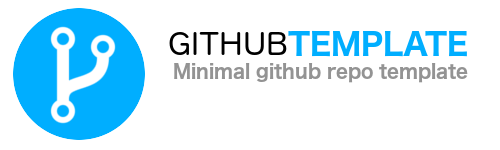
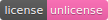

<!-- Have a nice logo. 500px x 150px suggested -->


<!-- Include relevant build badges -->
[](https://unlicense.org/)
[](https://github.com/clagraff/github-template/zipball/master/)

# Github Template
<!-- Short description of the project -->
This repo is a template for quick-starting new Github repos.


## About
This repo contains:

* [logo](.github/logo.png) which represents the project
* [pull request tempalte](.github/PULL_REQUEST_TEMPLATE.md) for helping users creating PRs.
* [issue template](.github/ISSUE_TEMPLATE.md) for helping users creating new issues.
* [readme](README.md) which you should override with project-specific details.
* [license](LICENSE.md) which you should override with your project's license.

The idea is you can download and use this template as a starter for any new
repos, saving you from having to duplicate effort across projects.

## Quickstart
Download the latest version of the template, unzip it, and copy it into your
empty project directory.

```bash
wget https://github.com/clagraff/github-template/zipball/master/ -O template.zip
unzip template.zip -d $YOUR_DIR
cd $YOUR_DIR
```

## .gitignore
You will probobly want a `.gitignore` file. If you do not already
have one, checkout Github's own [gitignore](https://github.com/github/gitignore)
repo which has a large collection of `.gitignore` templates.

For example, downloading a Python `.gitignore` is as easy as:
```bash
wget https://raw.githubusercontent.com/github/gitignore/master/Python.gitignore -O .gitignore
```

## Contributing
For detailed information, please view our
[contribution guidelines](.github/CONTRIBUTING.md).

We are always open to new issues or pull requests.

In the interest of fostering an open and welcoming environment, we hold
our contributors to a [code of conduct](.github/CODE_OF_CONDUCT.md).

# License
This is free and unencumbered software released into the public domain.

Anyone is free to copy, modify, publish, use, compile, sell, or
distribute this software, either in source code form or as a compiled
binary, for any purpose, commercial or non-commercial, and by any
means.

In jurisdictions that recognize copyright laws, the author or authors
of this software dedicate any and all copyright interest in the
software to the public domain. We make this dedication for the benefit
of the public at large and to the detriment of our heirs and
successors. We intend this dedication to be an overt act of
relinquishment in perpetuity of all present and future rights to this
software under copyright law.

THE SOFTWARE IS PROVIDED "AS IS", WITHOUT WARRANTY OF ANY KIND,
EXPRESS OR IMPLIED, INCLUDING BUT NOT LIMITED TO THE WARRANTIES OF
MERCHANTABILITY, FITNESS FOR A PARTICULAR PURPOSE AND NONINFRINGEMENT.
IN NO EVENT SHALL THE AUTHORS BE LIABLE FOR ANY CLAIM, DAMAGES OR
OTHER LIABILITY, WHETHER IN AN ACTION OF CONTRACT, TORT OR OTHERWISE,
ARISING FROM, OUT OF OR IN CONNECTION WITH THE SOFTWARE OR THE USE OR
OTHER DEALINGS IN THE SOFTWARE.

For more information, please refer to <http://unlicense.org>
